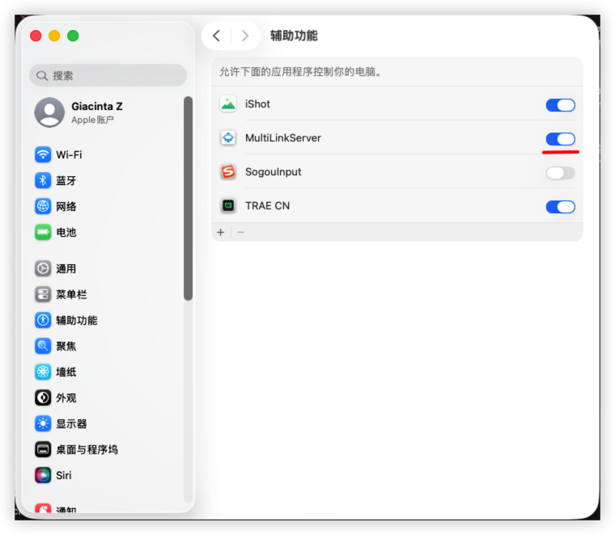

1.安装客户端
mac 下载地址为https://baidu.com/1.dmg
mac需要开启辅助功能，隐私与安全->辅助功能，找到程序点击开启，如下图所示。

windows x86_64 下载地址为https://baidu.com/3.exe
linux x86_64 下载地址为https://baidu.com/4.deb

2.网络要求
您的移动端（App）和电脑（客户端）必须在同一网络下或者可以相互访问通。客户端启动后，App端默认可以自动发现。

